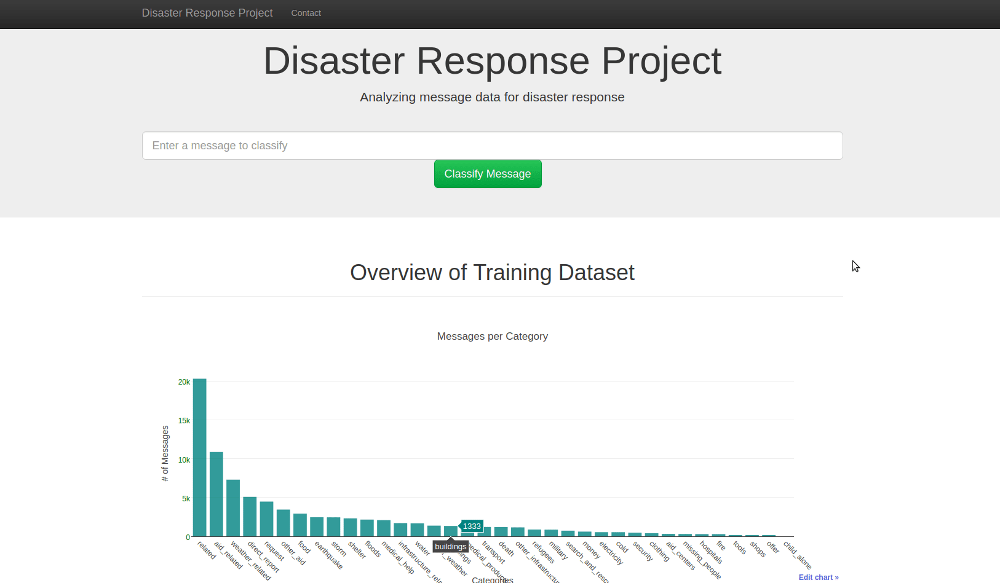

# Disaster Response Pipeline 

In this project using two datasets of distress mesages from three different channels, their response categories (36) and a data, NLP / Machinne learning pipeline we build an optimized classifier to predict in which response category is the message likelier to belong reducing the potential reaction time of 


<br>

## Description / Usage

The project consists of the following parts:

- **The ETL pipeline in the `/data` directory, which:**

	* Combines the two given datasets (In CSV  format)
	* Cleans the data
	* Stores it in a SQLite database
	
		**Usage:**    
			From the `/data` directory provide the filepaths of the messages and categories datasets as the first and second argument respectively, as well as the filepath of the database to save the cleaned data to as the third argument. For example:    


			python process_data.py disaster_messages.csv disaster_categories.csv DisasterResponse.db


- **The NLP and Machine Learning pipeline in the '/models' directory, which:**

	* Splits the dataset into training and test sets
	* Builds a text processing and machine learning pipeline
	* Trains and tunes a model using GridSearchCV
	* Outputs results on the test set
	* Exports the final model as a pickle file  

		**Usage:** 
			From the `/models` directory provide the filepath of the disaster messages database as the first argument and the filepath of the pickle file to save the model to as the second argument. For example:    


			 python train_classifier.py ../data/DisasterResponse.db classifier.pkl


- **The Flask app in the `./app` directory.**

	**Usage:**   
	- From the `/app` directory Run the following command to run the web app:

	```  
	python run.py   
	```   

	- Go to http://0.0.0.0:3001/   


## Code structure

- `app/`
  - `template/`
    - `master.html`  -  Main page of web application.
    - `go.html`  -  Classification result page of web application.
  - `run.py`  - Flask applications main file.

- `data/`
  - `disaster_categories.csv`  - Disaster categories dataset.
  - `disaster_messages.csv`  - Disaster Messages dataset.
  - `process_data.py` - The data processing pipeline script.
  - `DisasterResponse.db`   - The database with the merged and cleand data.

- `models/`
  - `train_classifier.py` - The NLP and ML pipeline script.

 - `media/` 
 	- `demo.gif` - A small demo gif of the appliction.
  


